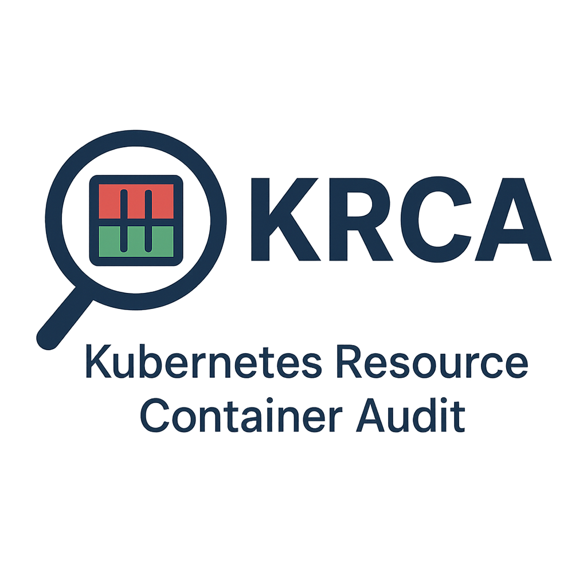
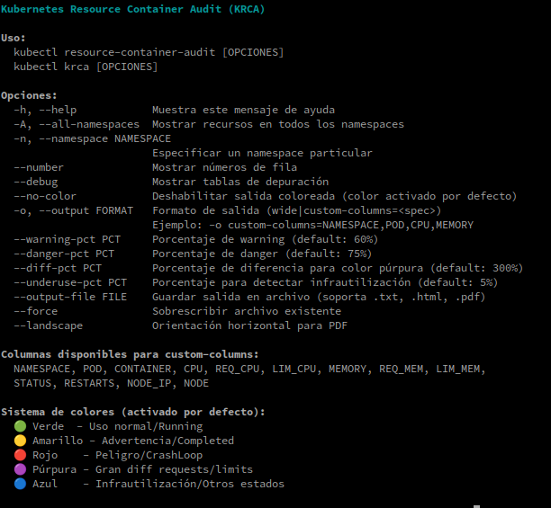
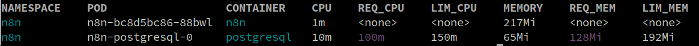

<div>
<p align="center">
  
</p>

<h1 align="center">🔍 KRCA - Kubernetes Resource Container Audit</h1>

<p align="center">
  <strong>Monitor • Analyze • Optimize your Kubernetes resources</strong>
</p>
</div>


> Es un plugin de línea de comandos para `kubectl` que permite:   
>  **auditar el uso de CPU,  memoria, Request y Limits** en contenedores de Kubernetes/OpenShift,   
> destacando posibles problemas de configuración de recursos mediante un sistema de **colores visuales**.  


## 📝 ideal para detectar:
- Uso excesivo de CPU o memoria
- Configuraciones incorrectas o ausentes de `requests` o `limits`
- Contenedores infrautilizados o sobreasignados
- Estados de error o reinicios frecuentes

---

## 📥 Instalación  
Ahora puedes instalar `kubectl-resource-container-audit` fácilmente con:  

```bash
curl -sSL https://raw.githubusercontent.com/upszot/kubectl-resource-container-audit/refs/heads/master/install.sh | bash
```

---

✅ Requisitos
 - Python 3.6+ (con dependencias listadas en requirements.txt).
 - wkhtmltopdf
 - kubectl configurado con acceso a un cluster válido
 - Acceso a permisos para listar pods y contenedores (kubectl get pods -A -o json)

---

🚀 Uso básico

```sh
kubectl krca --help
```


---

🎨 Sistema de colores  
🔴 Rojo	Uso > danger-pct o uso > limit. Estado CrashLoopBackOff.   
🟡 Amarillo	Uso > warning-pct. Requests o limits no definidos. Terminated: Completed.   
🟢 Verde	Uso normal entre request y limit. Estado: Running.   
🔵 Azul	Infrautilización (< underuse-pct). Otros estados (Waiting, etc).   
🟣 Púrpura	Diferencia excesiva entre requests y limits.   

---

📊 Ejemplo de salida  
<div>
<table>
   <tr>
      <td></td>
   </tr>
</table>
</div>

---

## Estructura del proyecto  
```sh
kubectl-resource-container-audit/
│
├── krca/                       # Paquete principal
│   ├── __init__.py             # Para que Python lo reconozca como paquete
│   ├── cli.py                  # Lógica de línea de comandos (argparse)
│   ├── core.py                 # Funcionalidades principales
│   ├── colorizer.py            # Lógica de colores y estilos
│   ├── kubectl.py              # Interacción con kubectl
│   ├── exporter.py             # Exportación (HTML/PDF/otros formatos)
│   ├── utils.py                # Funciones auxiliares
│   └── models.py               # Modelos de datos (si usas clases)
│
├── scripts/                    # Scripts ejecutables
│   └── krca                    # Punto de entrada (main)
│   └── krca-wrapper.sh         # Wrapper bash para instalación
│
├── output-test/                # Ejemplos de salida
│   ├── test.html
│   ├── test.pdf
│   ├── test.png
│   └── test.txt
│
└── requirements.txt            # Dependencias
```

---

🧑‍💻 Autor
Desarrollado por @upszot para entornos Kubernetes y OpenShift.

## 👥 Colaboradores
- **@Miguel** - mi 2do tester :-D
- 

---

📄 Licencia
[GPL 3.0](./LICENSE)
