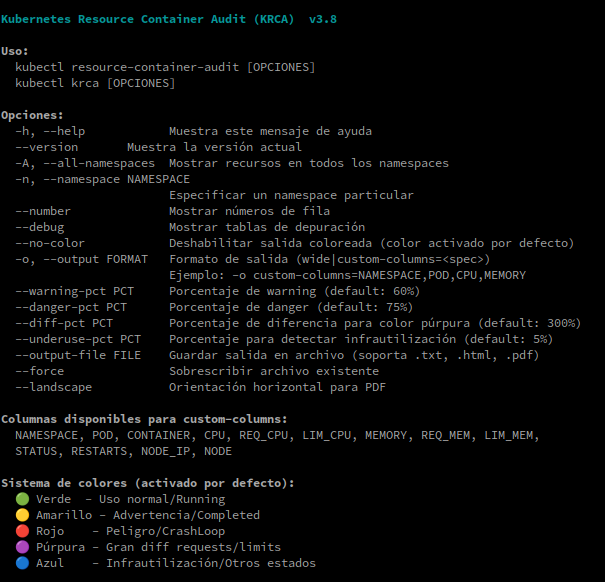

# kubectl-resource-container-audit (KRCA)

`kubectl-resource-container-audit` (alias `kubectl krca`) 
> Es un plugin de línea de comandos para `kubectl` que permite **auditar el uso de CPU,  memoria, Request y Limits** en contenedores de Kubernetes/OpenShift, </br>
> destacando posibles problemas de configuración de recursos mediante un sistema de **colores visuales**.

Ideal para detectar:

- Uso excesivo de CPU o memoria
- Configuraciones incorrectas o ausentes de `requests` o `limits`
- Contenedores infrautilizados o sobreasignados
- Estados de error o reinicios frecuentes

---

## 📥 Instalación  
Ahora puedes instalar `kubectl-resource-container-audit` fácilmente con:  

```bash
curl -sSL https://raw.githubusercontent.com/upszot/kubectl-resource-container-audit/refs/heads/master/install-krca.sh | bash
```

✅ Requisitos
 - Python 3.6+ (con dependencias listadas en requirements.txt).
 - wkhtmltopdf
 - kubectl configurado con acceso a un cluster válido
 - Acceso a permisos para listar pods y contenedores (kubectl get pods -A -o json)


🚀 Uso básico

```sh
kubectl krca --help
```


🎨 Sistema de colores

Color	Significado </br>
🔴 Rojo	Uso > danger-pct o uso > limit. Estado CrashLoopBackOff. </br>
🟡 Amarillo	Uso > warning-pct. Requests o limits no definidos. Terminated: Completed. </br>
🟢 Verde	Uso normal entre request y limit. Estado: Running. </br>
🔵 Azul	Infrautilización (< underuse-pct). Otros estados (Waiting, etc). </br>
🟣 Púrpura	Diferencia excesiva entre requests y limits. </br>


📊 Ejemplo de salida
```sh
NAMESPACE     POD              CONTAINER   CPU   REQ_CPU  LIM_CPU  MEMORY  REQ_MEM  LIM_MEM  STATUS        RESTARTS
default       app-abc-xyz      main        120m  100m     200m     90Mi    128Mi    512Mi    Running       0
default       job-123-fail     worker      10m   -        -        12Mi    -        -        CrashLoop...  4
```
Con colores según lo explicado anteriormente.


🧑‍💻 Autor
Desarrollado por @upszot para entornos Kubernetes y OpenShift.

## 👥 Colaboradores
- **@Miguel** - mi 2do tester :-D
- 

📄 Licencia
[GPL 3.0](./LICENSE)


## Estructura nueva

kubectl-resource-container-audit/
│
├── krca/                       # Paquete principal
│   ├── __init__.py             # Para que Python lo reconozca como paquete
│   ├── cli.py                  # Lógica de línea de comandos (argparse)
│   ├── core.py                 # Funcionalidades principales
│   ├── colorizer.py            # Lógica de colores y estilos
│   ├── kubectl.py              # Interacción con kubectl
│   ├── exporter.py             # Exportación (HTML/PDF/otros formatos)
│   ├── utils.py                # Funciones auxiliares
│   └── models.py               # Modelos de datos (si usas clases)
│
├── scripts/                    # Scripts ejecutables
│   └── krca                    # Punto de entrada (main)
│
├── tests/                      # Tests unitarios
│   ├── test_colorizer.py
│   ├── test_kubectl.py
│   └── ...
│
└── requirements.txt            # Dependencias
